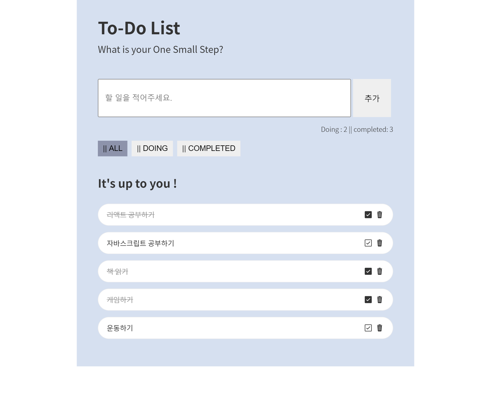

# Todo APP with Redux

## 리액트, 리덕스를 이용한 할 일 웹 어플리케이션

#### 링크: [TODO APP](https://jjjjhjjjj.github.io/Todo-App-Redux/)

#### 기능

- [Todo-App](https://github.com/jjjjhjjjj/Todo-App)과 기능 동일
  - 할 일 추가 (기본값 Doing)
  - 리스트 할 일 상태 카운트
  - All, Doing Completed로 할 일 리스트 구분
  - 체크 버튼, 휴지통 버튼 클릭으로 상태 변경 및 삭제
- Redux를 사용한 상태 관리

#### [DEMO LINK](https://michelle-todo.herokuapp.com/)
